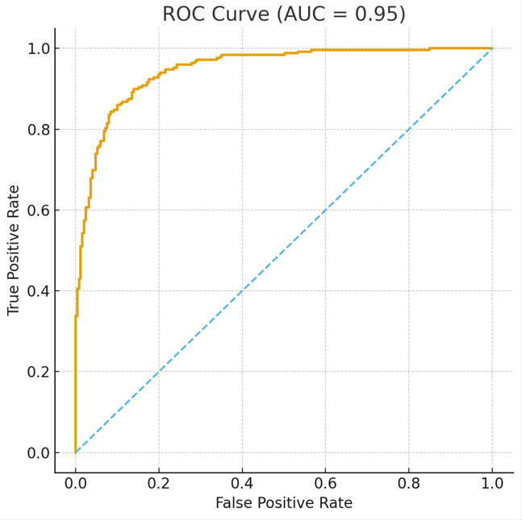

# Statistics & Probability Related
A curated knowledge base for statistical and probabilistic concepts, distributions, and analytical foundations

## Table of Contents
- [Project Background](#project-background)
- [Project Goal](#project-goal)
- [Distributions](#distributions)
  - [Normal Distribution](#normal-distribution)
  - [Discrete Probability Distribution](#discrete-probability-distribution)
  - [Uniform Distribution](#uniform-distribution)
  - [Binomial Distribution](#binomial-distribution)
  - [Bernoulli Distribution](#bernoulli-distribution)
  - [Poisson Distribution](#poisson-distribution)
  - [Exponential Distribution](#exponential-distribution)
- [Statistics Related](#statistics-related)
  - [P-Value](#p-value)
  - [Coefficient Value](#coefficient-value)
  - [Collinearity](#collinearity)
  - [Confidence Intervals & Prediction Intervals](#confidence-intervals--prediction-intervals)
  - [Confusion Matrix](#confusion-matrix)
  - [ROC Curve](#roc-curve)
  - [Hypothesis Testing](#hypothesis-testing)
  - [F-Test](#f-test)
  - [Chi-square Test](#chi-square-test)
  - [Covariance & Correlation](#covariance--correlation)
  - [PCA](#pca)

## Project Background
This document serves as a personal knowledge base for core concepts, terminology, and analytical frameworks in statistics and probability. It focuses on organizing fundamental ideas that support understanding, modeling, and analysis of uncertainty, randomness, and data-driven phenomena.

## Project Goal
The goal of this document is to provide a centralized and structured reference for essential statistical and probabilistic knowledge, enabling clearer conceptual understanding, consistent usage of statistical terminology, and more effective application of probability and statistical methods in analysis and modeling.

## Distributions
### Normal Distribution
*Definition*:   
Normal distribution is a probability distribution that is symmetric about the mean, showing that data near the mean are more frequent in occurrence than data far from the mean.

$$
N(\mu,\sigma^2) = \frac{1}{\sigma\sqrt{2\pi}}
e^{-\frac{(x-\mu)^2}{2\sigma^2}}
$$

where:
- $X$ is a continuous random variable;
- $x$ is a specific value of $X$;
- $\mu$ is the mean of the distribution;
- $\sigma$ is the standard deviation of the distribution, with $\sigma > 0$;
- $\sigma^2$ is the variance of the distribution.

*Mean*: $E(X) = \mu $
*Variance*: $V(X)= \sigma^2$

*Properties*:
- Unimodal (Only one mode);
- Symmetrical (left and right halves are mirror images);
- Bell-shaped (maximum height (mode) at the mean);
- Mean, Mode, and Median are all located in the center;
- Asymptotic.

A normal random variable with $\mu = 0$ and $\sigma^2 = 1$ is said to be a standard normal distribution and is denoted $Z$.

Z-score: tells how many standard deviations are away from the mean:
- 1 standard deviation: 68%
- 2 standard deviations: 95%
- 3 standard deviations: 99%

*z-distribution & t-distribution*:   
The z-distribution is the standard normal distribution with mean 0 and standard deviation 1. It is used when **the population standard deviation is known, or when the sample size is large** (more than 30 in practice) and the Central Limit Theorem applies.

The t-distribution is similar to the z-distribution but has heavier tails. It is used when **the population standard deviation is unknown and must be estimated from the sample**. The shape of the t-distribution depends on the sample size (degrees of freedom); with smaller samples, it is more spread out and produces wider confidence intervals.

As the sample size increases, the t-distribution converges to the z-distribution.

---

### Discrete Probability Distribution
*Definition*:   
Discrete probability distribution of a discrete random variable (RV) is a table or graph that assigns a probability to each possible value of the random variable.

*Mean*: $E(X) = \mu = \sum_{x} x\, P(X = x)$
*Variance*: $V(X)= \sum_{x} (x - \mu)^2\, P(X = x)$

--- 

### Uniform Distribution
*Definition*:   
Uniform distribution is a probability distribution in which every possible result is equally likely.

$$U(a, b) = \frac{1}{b - a}, \quad a \le x \le b$$

where:
- $X$ is a continuous random variable uniformly distributed on the interval $[a, b]$;
- $x$ is a specific value of the random variable $X$;
- $a$ and $b$ are the lower and upper bounds of the distribution, with $a \lt b$.

*Mean*: $E(X) = \frac{a + b}{2}$   
*Variance*: $V(X) = \frac{(b - a)^2}{12}$

--- 

### Binomial Distribution
*Definition*:   
Binomial distribution is a probability distribution of obtaining one of two outcomes under a given number of parameters.

$$P(Y = y) = \binom{n}{y} p^y (1 - p)^{n - y}, \quad y = 0, 1, 2, \dots, n$$

where:
- $Y$ is a random variable representing the number of successes;
- $n$ is the number of independent trials;
- $p$ is the probability of success in each trial;
- $y$ is the number of successes.

*Assumption*:
- the trials are independent;
- only one outcome for each trial;
- the chance (for success $p$) is the same for every trial.

*Mean*: $E(X) = np$   
*Variance*: $V(X) = np(1 - p)$

--- 

### Bernoulli Distribution
*Definition*:   
Bernoulli distribution is a special case of the binomial distribution where a single trial is conducted.

$$P(Y = 1) = p, \quad P(Y = 0) = 1 - p$$

where:
- $Y$ is a Bernoulli random variable;
- $1$ represents success and $0$ represents failure;
- $p$ is the probability of success, with $0 \le p \le 1$.

*Mean*: $E(X) = p$   
*Variance*: $V(X) = p(1-p)$

--- 

### Poisson Distribution
*Definition*: 
Poisson distribution is a probability distribution of how many times an event is likely to occur over a specified period.

$$P(X = x) = \frac{e^{-\lambda} \lambda^x}{x!}, \quad x = 0, 1, 2, \dots$$

where:
- $X$ is a random variable representing the number of events occurring in a fixed interval;
- $x$ is a specific observed number of events;
- $\lambda$ is the average rate (mean number) of events per period, with $\lambda \gt 0$.

*Assumption*:
- the events are independent;
- two events cannot occur at exactly the same instant;
- the rate of events stays the same.

*Mean*: $E(X) = \lambda$   
*Variance*: $V(X) = \lambda$   

Poisson distribution can be approximated with normal distribution ($\mu = \lambda, \sigma^2 = \lambda$) when λ is large ($\lambda \ge 20$).   

Poisson distribution is the limiting case of binomial distribution when $n$ is very large and $p$ is very small ($\lambda = np$). 

--- 

### Exponential Distribution
*Definition*:   
Exponential distribution is a probability distribution of the time between events in a Poisson point process, a process in which events occur continuously and independently at a constant average rate.

*Mean*: $E(X) = \frac{1}{\lambda}$   
*Variance*: $V(X) = \frac{1}{\lambda^2}$   

Poisson distribution deals with the number of occurrences in a fixed period of time, and exponential distribution deals with the time between occurrences of successive events as time flows by continuously.

---

## Statistics Related
### P-Value
*Definition*:   
Assuming the null hypothesis is true, the probability of obtaining a result equal to or "more extreme" than what was actually observed.

The p-value in the table is the minimum α (the level of significance, a user defined value) at which the coefficient is relevant. The lower the p-value, the more important is the variable in predicting the price.

---

### Coefficient Value
*Definition*:   
Holding other variables in the model constant, how much the mean of the dependent variable changes if the independent variable changes by one unit.

---

### Collinearity
*Definition*:   
Two or more independent variables are closely related to one another.

VIF, variance inflation factor, is a measure of the amount of multicollinearity in a set of multiple regression variables. If VIF > 10, the multicollinearity is severe.

---

### Confidence Intervals & Prediction Intervals
*Definition*:   
Confidence intervals tell you how well you have determined a parameter of interest.
Prediction intervals tell you where you can expect to see the next data point sampled. 

Confidence interval shows the likely range of values associated with some statistical parameter of the data, such as the population mean.
Prediction intervals predicts in what range a future individual observation will fall. 
Confidence interval CI are about the parameter of the population; prediction Interval PI are about outcomes. CI are much lower than PI.

---

### Confusion Matrix
*Definition*:   
| Actual/Predict | 1              | 0              |
|----------------|:--------------:|---------------:|
| 1              | True Positive  | False Negtaive |
| 0              | False Positive | True Negtaive  |

- Type I Error: False Positive				
- Type II Error: False Negative
- $Accuracy = \frac{TP+TN}{P+N}$
- $Error Rate = \frac{FP+FN}{P+N}$			
- True Positive Rate/Recall (Higher sensitivity → lower Type II error): $Sensitivity = \frac{TP}{TP+FN}$	  
- True Negative Rate (Higher specificity → lower Type I error): $Specificity = \frac{TN}{TN+FP}$	  
- Positive Predicted Value: $Precision = \frac{TP}{TP+FP}$	
- $F Score = \frac{2}{\frac{1}{Recall}+\frac{1}{Precision}} = \frac{2TP}{2TP+FP+FN}$

---

### ROC Curve
*Definition*:   
A Receiver Operating Characteristic (ROC) curve is a diagnostic plot that illustrates the performance of a binary classifier across all possible classification thresholds. It shows the trade-off between the True Positive Rate (TPR) and the False Positive Rate (FPR) as the decision threshold varies. 

A model with a curve closer to the top-left corner demonstrates stronger discriminative ability, and the Area Under the Curve (AUC) summarizes this performance into a single metric.

where:
- x Axis: False Positive Rate ($\frac{FP}{FP+TN}$)		
- y Axis: True Positive Rate (Sensitivity, Recall, $\frac{TP}{TP+FN}$)
- Left-down corner (0, 0): All classified as N, FP = 0 and TP = 0
- Right-up corner (1, 1): All classified as T, FP = 1 and TP = 1
- ROC is robust to imbalance, unlike raw accuracy.

---

### Hypothesis Testing
*Definition*:   
Hypothesis testing is a form of statistical inference that uses data from a sample to draw conclusions about a population parameter or a population probability distribution.

---

### F-Test
*Definition*:   
An F-test is any statistical test that uses an F-distributed test statistic under the null hypothesis.
The F-statistic is typically constructed as a ratio of two independent variance estimates (mean squares), each scaled by their degrees of freedom.
It is used to compare variability across groups, compare statistical models, or test joint hypotheses about parameters.

**F-test in Linear Regression (Model Significance Test)**:
The F-statistic tells if any of the independent variables is related to the dependent variable.

Hypotheses:

$$H_0: \beta_1 = \beta_2 = ... = \beta_k = 0$$

$$H_1: \text{At least one} \beta_i ≠ 0$$

Relationship between F-test and t-test:
In simple linear regression (one predictor), the overall F-test is mathematically equivalent to the t-test for the slope, because:

$$F = t^2$$

This equivalence holds only when the model has a single predictor. In multiple regression, ANOVA, or variance tests, F-tests serve different purposes and are not interchangeable with t-tests.

**F-test in ANOVA (Analysis of Variance)**:
The F-statistic tells if the means of two or more population are equal.

Hypotheses:

$$H_0: \mu_1 = \mu_2 = ... = \mu_k$$

In ANOVA, the F-statistic compares:
- Between-group variance: how far the group means are from each other
- Within-group variance: random variation inside each group
F is the ratio of between-group mean square to within-group mean square.
If the group means are truly equal, the differences between groups should be no larger than random noise, so the two variances are similar and F ≈ 1.
But if between-group variance is much larger than within-group variance, the observed differences cannot be explained by randomness alone, meaning the group means must differ.

**F-test of Equal Variances**:
The F-statistic tells if whether two normal populations have the same variance.

Hypotheses:

$$H_0: \sigma_1^2 = \sigma_2^2$$

---

### Chi-square Test
*Definition*:   
The Chi-square test is a statistical hypothesis test used to compare observed frequencies with expected frequencies under a given null hypothesis.

$$\chi^2 = \sum_{i=1}^{r} \sum_{j=1}^{c} \frac{(O_{ij} - E_{ij})^2}{E_{ij}}$$

**Chi-square Goodness-of-fit Test**:
The Chi-square Goodness-of-fit test examines whether a sample distribution is consistent with a specified theoretical distribution.
It compares the observed frequencies of a single categorical variable to the frequencies expected under a specified theoretical distribution.

**Chi-square Test of Independence**:
The Chi-square Test of independence examines whether there is a statistically significant association between two categorical variables.
It compares the observed frequencies in a contingency table to the frequencies expected if the two categorical variables are independent.

**Chi-square Test of Homogeneity**:
The Chi-square test of homogeneity is a statistical hypothesis test used to determine whether different populations have the same distribution of a categorical variable.
It compares the observed frequencies across groups to the frequencies expected if all populations share an identical distribution.

---

### Covariance & Correlation
*Definition*:   
Covariance indicates the direction of the relationship between two variables but is scale-dependent and difficult to interpret in magnitude. 

Correlation standardizes covariance by the variables’ standard deviations, providing a unit-free measure of both the strength and direction of their linear relationship.

Pearson correlation measures linear association only. Variables can be positively related in a nonlinear or monotonic way while exhibiting low or zero Pearson correlation.

---

### PCA
*Definition*:   
PCA (Principal Component Analysis) is a dimensionality reduction technique that projects high-dimensional data onto a lower-dimensional linear subspace.

The projection is chosen such that the first principal component captures the maximum possible variance in the data, and each subsequent component captures the maximum remaining variance subject to being orthogonal to the previous ones.

The resulting principal components define the best low-dimensional linear approximation of the original data in terms of minimizing reconstruction error.
